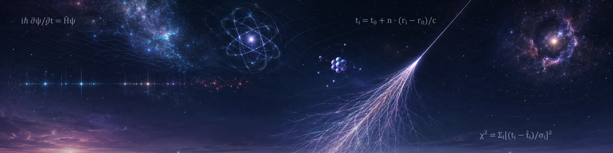

<picture>
  <source media="(prefers-color-scheme: dark)" srcset="assets/profile-banner-cosmic-v2.png">
  <source media="(prefers-color-scheme: light)" srcset="assets/profile-banner-cosmic-v2-light.png">
  
</picture>

<h1 align="center">Muhammad Samad Mahar</h1>

<strong>Physics × Computer Science at the University of Victoria</strong>

Physics-first computational research · validated numerical methods · reliable scientific software

  <a href="mailto:mmahar@uvic.ca">mmahar@uvic.ca</a> ·
  <a href="https://www.linkedin.com/in/abdul-samad-mahar-4a5a00318">LinkedIn</a> ·
  Victoria, BC, Canada

I am a Physics and Computer Science undergraduate interested in how detector measurements become defensible physical inferences. My work combines mathematical modelling, uncertainty-aware computation, careful validation, and software that can eventually make a scientific method usable by other people.

## Current research: cosmic-ray direction reconstruction

> How accurately can an air shower's arrival direction be reconstructed from surface-detector positions, timing measurements, and timing uncertainties - and can carefully validated corrections improve on a transparent physics baseline?

My main project uses [Pierre Auger Open Data](https://opendata.auger.org/) to study this question as an undergraduate computational-physics project. The comparison target is Auger's published reconstruction; I do **not** claim to reproduce or improve the Collaboration's full reconstruction.

### Verified in the repository

- A [derivation of the moving-plane timing model](https://github.com/abdul-samad021/auger_direction_reconstruction/blob/main/docs/learning/day_02_plane_front_reconstruction.md), including direction conventions, weighting, residuals, and limitations.
- A [constrained plane-front fitter](https://github.com/abdul-samad021/auger_direction_reconstruction/blob/main/src/auger_reco/physics/plane_front.py) with uncertainty-weighted and uniform objectives, SVD-based initialization, numerical diagnostics, and structured optimizer failures.
- [Deterministic scientific tests](https://github.com/abdul-samad021/auger_direction_reconstruction/blob/main/tests/test_plane_front.py) for exact synthetic recovery, noisy timing, angular edge cases, weak geometry, repeatability, and failure paths.
- Checksum-recorded data acquisition, schema checks, a [field and leakage policy](https://github.com/abdul-samad021/auger_direction_reconstruction/blob/main/docs/field_policy.md), and a [frozen 1,000-event pilot cohort](https://github.com/abdul-samad021/auger_direction_reconstruction/blob/main/data/manifests/pilot_sd1500_vertical_v1.audit.json).
- A first [surface-detector timing and signal footprint](https://github.com/abdul-samad021/auger_direction_reconstruction/blob/main/reports/figures/event_81847956000_footprint_with_rejected.png) from an official example event.

### In active development

- Finishing the strict event-JSON adapter and connecting real events to the tested production fitter.
- Verifying coordinate and angle conventions before revealing reference directions.
- Running the first real-event reconstruction, followed by a small diagnostic cohort.

### Planned after the baseline is frozen

- Evaluate the fixed 1,000-event cohort and report angular-error distributions, failures, and uncertainty.
- Test a physically motivated shower-front-curvature model.
- Add a leakage-controlled ML residual correction only if held-out evidence supports it.
- Package the frozen scientific method behind an API, container, and interactive event viewer.

[Explore the Auger direction-reconstruction repository →](https://github.com/abdul-samad021/auger_direction_reconstruction)

## Selected supporting project

### ExoVision · NASA Space Apps Challenge 2025

A four-person hackathon project presenting exoplanet-model evaluation through an interactive React and FastAPI application. The [public repository](https://github.com/abdul-samad021/spaceapps-exoplanets) lists me as a team member and documents the team-built application; it does not yet preserve component-level authorship, so I present it as team experience rather than individual ownership.

**Team methods:** React, Vite, FastAPI, scikit-learn, data visualization  
**Evidence:** [project documentation](https://github.com/abdul-samad021/spaceapps-exoplanets/blob/main/README.md) · [working demo](https://spaceapps-exoplanets.vercel.app/)

## Computational toolkit

- **Scientific computing:** Python, NumPy, SciPy, pandas, Matplotlib, Jupyter
- **Numerical methods:** constrained nonlinear least squares, SVD, uncertainty weighting, angular metrics, Monte Carlo validation
- **Testing and reproducibility:** pytest, deterministic synthetic tests, `uv` lockfiles, TOML configuration, recorded checksums and data manifests
- **Software engineering:** packaged `src/` layouts, command-line interfaces, Git, Ruff, explicit errors and diagnostics
- **Deployment - next phase:** typed APIs, Docker, and cloud delivery after the scientific result is frozen

## Research interests

Astrophysics · particle astrophysics · detector data · computational modelling · uncertainty-aware inference · trustworthy machine learning for physical measurements

## How I approach research software

- Write down physical assumptions and coordinate conventions.
- Separate measurement-level inputs from evaluation answers.
- Recover known synthetic truth before interpreting real data.
- Treat optimizer failures and weak geometry as results to diagnose, not cases to hide.
- Prefer reproducible experiments and held-out evidence to impressive-looking metrics.

<strong>Next research directions</strong>

- **Quasar and AGN spectral ML:** planned future research; no implementation or result is claimed yet.
- **Selected computational-physics coursework:** pending curation and an academic-integrity and redistribution review before anything is made public.

